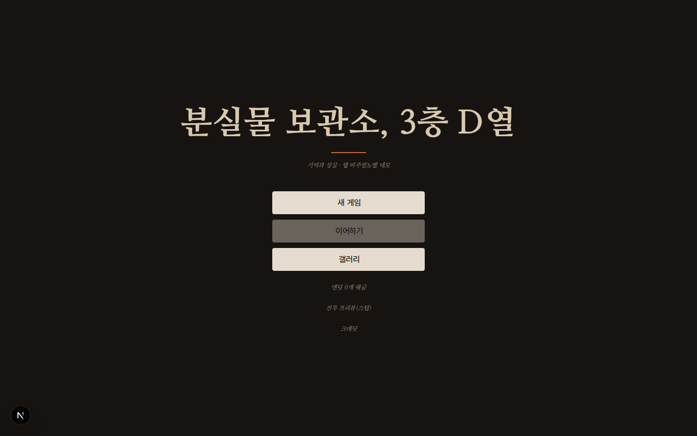

# 분실물 보관소, 3층 D열

> *"잊고 싶은 일이 있으면 그 일과 얽힌 물건을 3층 D열에 맡겨라. 다음 날이면 잊게 된다."*

기억과 상실을 테마로 한 웹 비주얼노벨 데모. 자작 React/Next.js VN 런타임 위에서 돌아가며,
분기·플래그·호감도·세이브/로드·CG 갤러리·SD 스프라이트 전투 프리뷰를 갖춘 미디엄 규모(30~60분) 데모다.

<p>
  
  
</p>

## 소개

경기권 신도시의 사립 한서고등학교 본관 3층 끝. 원래 창고였던 방이 '분실물 보관소'로 운영된다.
관리인은 2학년 **정하람**, 봉사시간 대체 아르바이트다.

그런데 이 학교에서는 아무도 그의 이름을 부르지 않는다. "관리인", "저기", "너".
그는 매일 아침 자기소개를 다시 하고, 그걸 자기 성격 탓이라 믿으며 웃어넘긴다.

어느 날 맡겨진 손목시계를 개봉하면서, 마침 보관소에 모여 있던 세 사람 —
방송부 1학년 **문세아**, 같은 반 학생회 서기 **백리원**, 상담실 인턴 **강윤슬** — 과 함께
하람은 자기가 잊어버린 3년 전 어느 가을을 되짚기 시작한다.

히로인 3인 루트 + 세 루트를 모두 본 뒤 해금되는 트루 루트로 구성된다.

## 플레이 방법 (로컬 실행)

Node.js 20 이상이 필요하다.

```bash
git clone <이 저장소>
cd miyensi/app
npm install
npm run dev        # http://localhost:3000
```

프로덕션 빌드로 확인하려면:

```bash
npm run build && npm start
```

## 조작법

| 동작 | 조작 |
|---|---|
| 대사 진행 | 대화창 클릭/탭 (타이핑 중 클릭하면 즉시 전문 표시) |
| 선택지 | 선택지 버튼 클릭 |
| AUTO / SKIP | 퀵메뉴 아이콘 토글 |
| 백로그 | 퀵메뉴 목록 아이콘 |
| 세이브 / 로드 | 퀵메뉴 아이콘 (슬롯 0 = 오토세이브, 1~9 = 수동) |
| 설정 | 퀵메뉴 톱니 아이콘 (텍스트 속도·볼륨) |
| 갤러리 뷰어 | 좌우 화살표 키 또는 스와이프로 이동, `Esc`로 닫기 |
| 크레딧 | 타이틀 화면 하단 "크레딧" |

세이브 데이터는 브라우저 `localStorage`에 저장된다. 타이틀의 "이어하기"는 오토세이브(슬롯 0) 기준이다.

## 기술 스택

- **Next.js 16 (App Router) · React 19 · TypeScript** — 라우트는 `/`(타이틀) `/play` `/gallery` `/battle`
- **자작 VN 엔진** (`app/src/engine`) — 씬 스크립트를 TS discriminated union으로 정의하고
  순수 함수 인터프리터가 실행한다. zustand 상태, localStorage 세이브(버전 마이그레이션 포함),
  씬 단위 에셋 프리로더, Howler 오디오 래퍼
- **씬 정합성 검사기** (`pipeline/scripts/validate_scenes.mjs`) — `prebuild`에서 자동 실행되어
  존재하지 않는 에셋 키·점프 라벨·플래그를 빌드 전에 잡는다
- **vitest** — 인터프리터·세이브·전 루트 주파 유닛 테스트
- **에셋 파이프라인** (`pipeline/`, 비배포) — 이미지 gpt-image-2, 전투 SD 스프라이트 sprite-gen,
  오디오 ffmpeg 정규화(BGM -14 LUFS / SFX -16 LUFS)

```bash
npm run test             # vitest
npm run validate:scenes  # 씬 스크립트 정합성 단독 검사
npm run lint             # eslint
```

설계 정본: [`docs/ARCHITECTURE.md`](docs/ARCHITECTURE.md) · 디자인 토큰: [`docs/DESIGN-SYSTEM.md`](docs/DESIGN-SYSTEM.md)

## 저장소 구조

- `app/` — Next.js 앱(Vercel Root Directory). 엔진(`src/engine`), 데이터(`src/data`), 컴포넌트(`src/components`)
- `pipeline/` — 에셋 생산 작업장(비배포). 프롬프트 배치, 스프라이트 생성, 오디오 스크립트, 검사기
- `docs/` — 기획 문서(비배포). 스토리·캐릭터·디자인시스템 확정본
- `trailer/` — 트레일러 작업장

## 크레딧

제작: 엔진 자작(Next.js · React · TypeScript) · 이미지 gpt-image-2 · 전투 SD 스프라이트 sprite-gen

### 음악 — Creative Commons BY 4.0 (표기 의무)

```
Music: "Carefree", "Fluffing a Duck", "Gymnopedie No 1", "Frost Waltz",
"Long Note Two", "8bit Dungeon Boss", "Heartbreaking"
by Kevin MacLeod (incompetech.com)
Licensed under Creative Commons: By Attribution 4.0
https://creativecommons.org/licenses/by/4.0/
```

### 효과음

Pixabay Content License · CC0 1.0 (OpenGameArt, Freesound) · 일부 자체 합성.
항목별 출처와 가공 내역은 [`pipeline/audio/LICENSES.md`](pipeline/audio/LICENSES.md)에 전량 기록되어 있다.

### 서체

Pretendard · 나눔명조 (SIL Open Font License 1.1)

같은 내용을 게임 안에서도 타이틀 화면 하단 **크레딧**에서 확인할 수 있다.
